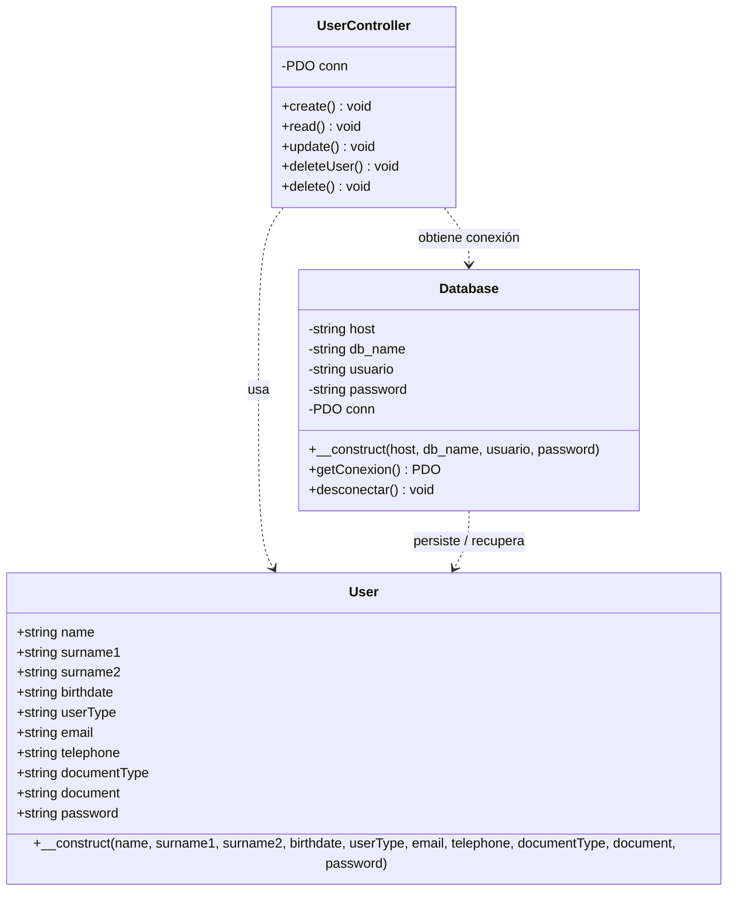
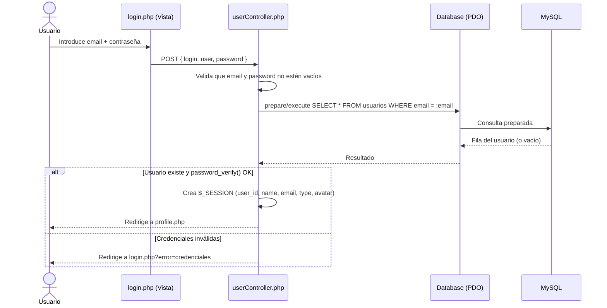
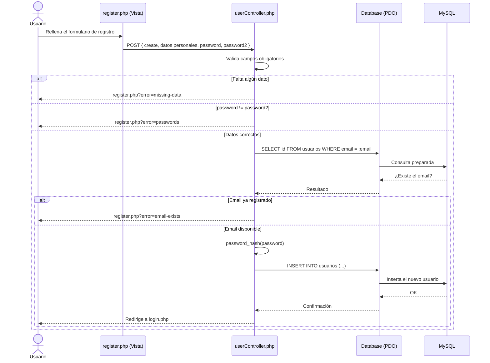

# Forever Events

> Plataforma web para la gestión y descubrimiento de eventos, construida con PHP siguiendo el patrón **MVC** (Modelo–Vista–Controlador) y MySQL como base de datos.

---

## Índice

1. [Introducción](#introducción)
2. [Funcionalidades](#funcionalidades)
3. [Cómo funciona](#cómo-funciona)
   - [Arquitectura MVC](#arquitectura-mvc)
   - [Estructura de carpetas](#estructura-de-carpetas)
   - [Modelo de datos](#modelo-de-datos)
   - [Diagrama de clase de `User`](#diagrama-de-clase-de-user)
   - [Diagrama de secuencia: Login](#diagrama-de-secuencia-login)
   - [Diagrama de secuencia: Registro](#diagrama-de-secuencia-registro)
4. [Puesta en marcha](#puesta-en-marcha)

---

## Introducción

**Forever Events** es una plataforma web que permite a los usuarios registrarse, iniciar sesión y descubrir eventos (conciertos, celebraciones, eventos culturales y corporativos…). Los usuarios con rol de **gestor** pueden además crear, editar y eliminar sus propios eventos, incluyendo imágenes de portada y de ubicación.

La aplicación está desarrollada en **PHP puro** organizado bajo el patrón **MVC**, lo que separa con claridad la lógica de datos, la presentación y el control de las peticiones:

- **Modelo** — Define las entidades del dominio (`User`, `Event`) y centraliza el acceso a la base de datos MySQL a través de la clase `Database` (PDO).
- **Vista** — Páginas PHP que renderizan la interfaz con HTML, CSS y JavaScript (jQuery + Slick para la interactividad).
- **Controlador** — `userController.php` y `eventController.php` reciben las peticiones HTTP, validan los datos, ejecutan la lógica de negocio y redirigen o devuelven respuestas (incluida una **API JSON** para la lectura/borrado de eventos).

La seguridad se cuida con **consultas preparadas (PDO)** para evitar inyección SQL, **hashing de contraseñas** con `password_hash()`/`password_verify()`, y **gestión de sesiones** para el control de acceso.

---

## Funcionalidades

### Usuarios y autenticación
- **Registro de usuarios** — Alta con datos personales (nombre, apellidos, fecha de nacimiento), tipo de documento, contacto, rol y contraseña. Valida campos obligatorios, coincidencia de contraseñas y unicidad del email.
- **Inicio de sesión** — Autenticación por email + contraseña con verificación segura (`password_verify`) y creación de sesión.
- **Gestión de perfil** — Actualización de datos personales y cambio de contraseña (verificando la contraseña actual). Los **gestores** pueden subir un avatar (JPEG/PNG/WebP).
- **Baja de cuenta** — Eliminación de la cuenta previa confirmación con contraseña; borra también los eventos del usuario y sus imágenes asociadas.
- **Cierre de sesión** — Destrucción segura de la sesión.
- **Recuperación de contraseña** — Página dedicada (`forgotPassword.php`).

### Eventos
- **Creación de eventos** (solo gestores) — Título, descripción, categoría, fecha, hora, dirección, código postal, ciudad, email de contacto e imágenes de portada/ubicación. Valida formato de email, fecha y hora, y evita duplicados (mismo título + fecha).
- **Listado y detalle de eventos** — Página de eventos con buscador y página de detalle por evento.
- **Edición de eventos** (solo el organizador propietario) — Reemplaza imágenes y datos, eliminando los ficheros antiguos.
- **Eliminación de eventos** — Vía API JSON con control de permisos (solo el organizador puede borrar su evento).
- **API JSON de eventos** — `eventController.php` responde a `GET ?id=` y `DELETE ?id=` con códigos HTTP y cuerpo JSON (`200`, `400`, `401`, `403`, `404`, `500`).

### Interfaz e interactividad (cliente)
- **Modal reutilizable** con overlay, cierre con `Esc`/click externo (`$.uiModal`, jQuery).
- **Tooltips on-hover** sobre las tarjetas de evento.
- **Aviso de cookies** que controla el acceso al login, con estado persistido en `localStorage`.
- **Sliders responsive** (Slick Carousel) de conciertos y promotores en la landing page.

> Para el detalle de las funcionalidades de cliente (jQuery/Slick), véase [`INFORME.md`](./INFORME.md).

---

## Cómo funciona

### Arquitectura MVC

El flujo de una petición sigue siempre el mismo recorrido:

```
Usuario (formulario / enlace)
        │  HTTP (POST / GET / DELETE)
        ▼
Controlador  ──►  valida datos y aplica reglas de negocio
        │
        ▼
Modelo (User / Event)  ──►  Database (PDO)  ──►  MySQL
        │
        ▼
Respuesta: redirección a una Vista  ó  JSON (API de eventos)
```

1. **Vista** — El usuario interactúa con un formulario o enlace en `View/pages/*.php`.
2. **Controlador** — Recibe la petición, comprueba la sesión y los permisos, valida los datos de entrada.
3. **Modelo** — Las clases `User`/`Event` representan las entidades; `Database` provee la conexión PDO y las consultas se ejecutan de forma preparada.
4. **Respuesta** — El controlador redirige a la vista correspondiente (con parámetros de éxito/error) o, en el caso de la API de eventos, devuelve JSON con el código HTTP adecuado.

### Estructura de carpetas

```
uiUX_html-css/
├── Config/
│   └── Database.php          # Conexión PDO a MySQL
├── Controller/
│   ├── userController.php     # Registro, login, perfil, baja, logout
│   └── eventController.php    # CRUD de eventos + API JSON
├── Model/
│   ├── User.php               # Entidad usuario
│   ├── Event.php              # Entidad evento (fromDbRow / toArray)
│   ├── db.sql                 # Esquema + datos semilla
│   └── seed_events.sql        # Eventos de prueba
└── View/
    ├── pages/                 # Páginas (login, register, profile, events, …)
    └── Assets/                # CSS, JS (jQuery, Slick), imágenes, vendor
```

### Modelo de datos

La base de datos `forever_events` (ver `Model/db.sql`) contiene cuatro tablas:

| Tabla             | Descripción                                                                 |
| ----------------- | --------------------------------------------------------------------------- |
| `tipos_usuario`   | Roles: `1 = Gestor`, `2 = Usuario`.                                         |
| `tipos_documento` | DNI, NIE, Pasaporte, Otro.                                                  |
| `usuarios`        | Datos del usuario, email/documento únicos, contraseña *hasheada*, avatar.  |
| `eventos`         | Eventos con FK `organizador_id → usuarios.id` y único `(titulo, fecha)`.    |

> **Credenciales de prueba** (creadas por el seed): `test@forever.com` / `Test1234!` (rol Gestor).

### Diagrama de clase de `User`

La clase `User` (`Model/User.php`) es un objeto de dominio que agrupa los datos del usuario. La persistencia se delega en `Database` (PDO), que utilizan los controladores.



### Diagrama de secuencia: Login

Flujo real de `UserController::read()` (la vista envía el formulario con el campo `login` y el email en `user`).



### Diagrama de secuencia: Registro

Flujo real de `UserController::create()` (formulario de `register.php` con el campo `create`).



---

## Puesta en marcha

1. **Requisitos**: PHP 7.4+ (con extensión PDO MySQL) y MySQL/MariaDB. Recomendado usar XAMPP, Laragon o similar.
2. **Base de datos**: importa el esquema y los datos semilla.
   ```bash
   mysql -u root < Model/db.sql
   # (opcional) eventos de ejemplo adicionales
   mysql -u root forever_events < Model/seed_events.sql
   ```
3. **Configuración de conexión**: los controladores se conectan con `new Database('localhost', 'forever_events', 'root', '')`. Ajusta usuario/contraseña en `userController.php` y `eventController.php` si tu MySQL los requiere.
4. **Servir la aplicación**: coloca el proyecto bajo el *document root* de tu servidor (p. ej. `htdocs/`) y abre la página de inicio o `View/pages/login.php` en el navegador.
5. **Acceso de prueba**: `test@forever.com` / `Test1234!`.
