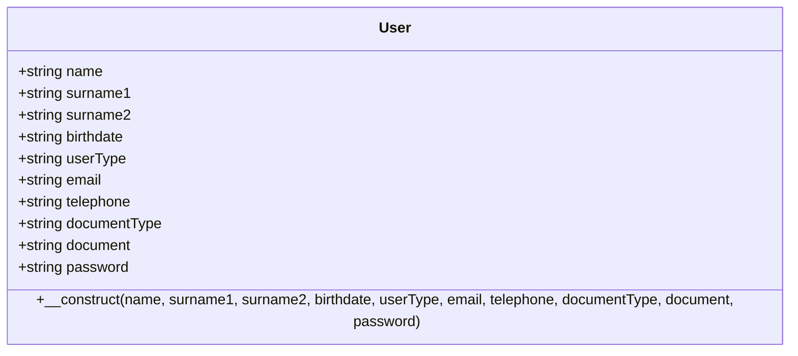
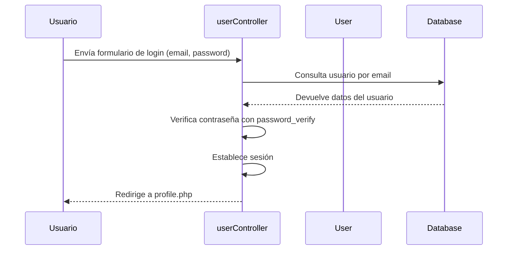
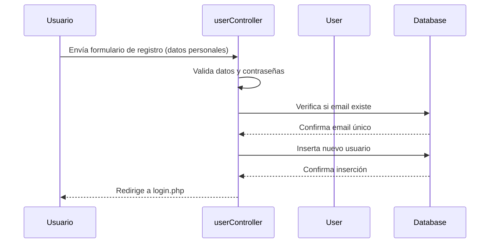

# Forever Events

## Introducción

Forever Events es una plataforma web desarrollada en PHP utilizando el patrón de arquitectura MVC (Modelo-Vista-Controlador). Esta aplicación permite a los usuarios registrarse, iniciar sesión y gestionar eventos de manera intuitiva y eficiente. Diseñada para facilitar la organización de eventos inolvidables, desde bodas y celebraciones hasta eventos corporativos, Forever Events ofrece una experiencia completa para gestores y usuarios finales.

El proyecto está estructurado en tres capas principales:
- **Modelo**: Gestiona la lógica de datos y las interacciones con la base de datos MySQL.
- **Vista**: Maneja la presentación y la interfaz de usuario con HTML, CSS y JavaScript.
- **Controlador**: Coordina las solicitudes del usuario, procesa la lógica de negocio y actualiza las vistas.

## Funcionalidades

- **Registro de Usuarios**: Permite a nuevos usuarios crear una cuenta proporcionando información personal, tipo de documento, email y contraseña.
- **Inicio de Sesión**: Autenticación segura con verificación de credenciales y manejo de sesiones.
- **Gestión de Perfil**: Los usuarios pueden actualizar su información personal, cambiar contraseña y subir avatares (disponible para gestores).
- **Página de Inicio**: Interfaz principal donde los usuarios pueden navegar por la plataforma.
- **Gestión de Eventos**: Creación y visualización de eventos (funcionalidad en desarrollo).
- **Recuperación de Contraseña**: Página dedicada para restablecer contraseñas olvidadas (funcionalidad en desarrollo).
- **Cierre de Sesión**: Opción segura para terminar la sesión del usuario.

## Cómo Funciona

La aplicación sigue el patrón MVC para separar las responsabilidades:

1. **Solicitudes del Usuario**: Las interacciones llegan a través de formularios en las vistas (páginas PHP).
2. **Controlador**: El `userController.php` recibe las solicitudes POST, valida los datos y ejecuta las operaciones correspondientes (crear, leer, actualizar, eliminar usuarios).
3. **Modelo**: La clase `User.php` representa la entidad usuario, mientras que `Database.php` maneja la conexión a la base de datos.
4. **Vista**: Las páginas en `View/pages/` renderizan la interfaz y muestran los resultados.

### Diagrama de Clase de User

### Diagrama de Secuencia de Login

### Diagrama de Secuencia de Registro

